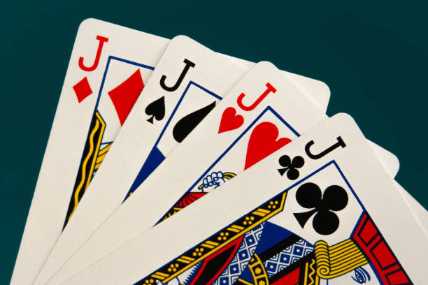

# CPTR 142 Project 1

## Problem Overview

**War** is a simple card game that is played between two players.
Read about the full game on [Wikipedia](https://en.wikipedia.org/wiki/War_(card_game)).

### Playing The Game

The game uses a standard deck of playing cards.
The cards are dealt evenly to the two players (26 cards each).
The players cards are kept face down.
The players turn over the top card at the same time.
Who ever has the highest card, wins all the cards.
If the players have the same card, ignoring suits, a battle begins.
Each player puts three cards face down and flips the four face up.
Who ever has the high card wins all the cards played.
If they are the same card, an other battle begins, and so on.
The goal is to collect all the cards.

See wikipedia for more complete game rules.



## Our Variations To Simplify

The cards will be labeled 1 to 13.

**Managing the player decks:**
The cards that have been played are add to the pot starting with player 1 and then player 2.
So if both players turn over a card, player 1 goes on the top and then player 2.
If a battle begins, three cards for player 1 go on the top and then three cards from player 2

Example several scenarios:
* The player with the higher card takes both cards and adds them to the bottom of their deck.
    * Player 1's card gets placed first then player 2's card.
    * Cards played: `p1`, `p2` are added to bottom of the winners deck.

        **The winners deck order**
        ```text
        wX, wX, wX, p1, p2
        ```

        where `wX` are the cards in the winners deck.

* If the cards are the same value then there is a "battle".
    * Each player places three cards down.
        * Cards played: `p1.1`, `p2.1` from the matching round are followed by three cards (`p1.2`, `p1.3`, `p1.4`, `p2.2`, `p2.3`, `p2.4`) from each player.

            **The pot**
            ```text
            p1.1, p2.1, p1.2, p1.3, p1.4, p2.2, p2.3, p2.4 
            ```

            where `p1.2` describes player 1's second card played.
    * The forth card determines who wins that round. The cards are collected in the order they were placed down.
        * Cards played: `p1.5`, `p2.5` determine in the winnder of the battle. The following is the winners deck order.

            **The winners deck order**
            ```text
            wX, wX, wX, p1.1, p2.1, p1.2, p1.3, p1.4, p2.2, p2.3, p2.4, p1.5, p2.5
            ```

             where `wX` are the cards in the winners deck.

* Once a player runs out of cards, the game is over. The winner has all the cards.

## Solution Specifications

Your solution should strive to meet the standards specified below as they form the basis on which it will be graded.

1. Your program will simulate the actions by all players in an entire game, from start to finish, and report the game's outcome to the console.
1. Your program must be divided into classes and functions which perform well-defined and logical sub-tasks for the problem.
   You may check with your professor or TA about your choice of functions and the parameters and/or return types that they will require.
1. Define a `Player` class and create an instance for each player.
    1. Include a player name as a class attribute.
    1. Save the class in a separate file.
1. A test driver for the `Player`.
    1. Write a test for each method in the player class. 
    1. Create a test program to run your tests and verifying that the functionality is correct.
1. Create a **program** to simulate the game.
    1. Read in the provided deck of cards from a file and use them for the card deck.
    1. Always have player 1 go first.
    1. Give each player a turn to reveal the card on the top of their deck.
    1. When the game ends, report which player won (by name) and how many turns it took to finish the game.
    1. Save main program in separate file.

## Sample Runs

The results will vary depending how the game is played. If you play similarly to how it is described on Wikipedia, then your results should look like:

Deck                 | Winner   | Turns
---------------------|----------|------:
`deck_test_play.txt` | Player 2 | 7
`deck_test_war.txt`  | Player 2 | 1
`deck_a.txt`         | Player 2 | 85
`deck_b.txt`         | Player 1 | 683

If your game is designed so that when a player doesn't have enough cards in their hand during a war loses, your results should look like:

Deck                 | Winner   | Turns
---------------------|----------|------:
`deck_a.txt`         | Player 2 | 47
`deck_b.txt`         | Player 1 | 666

## Code Review

You should have a code review by a tutor before turning in the assignment.
See the Code Review Rubric document for expectations.
I suggest that you schedule your appointment early!